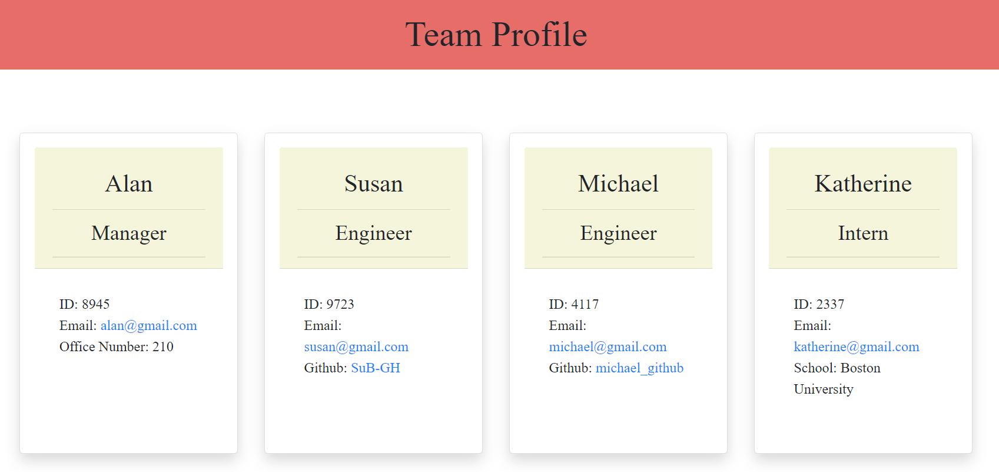

# Team Profile Generator

## Description
This command-line application generates a webpage that contains basic information about employees on a team. The command-line will prompt users for information about each employee, including: name, email address, and employee ID, and will then generate profile "cards" for each employee for easy viewing and reference.

## Installation
This application uses the following technologies. Installation of these will be required in order to use the app:  
Node.js  
Inquirer  
Jest (for testing)

## Usage
Upon successful installation of the Inquirer package, enter "node index.js" from the command line to initiate the prompts. 

Screenshot

## Link to walkthrough video:
https://drive.google.com/file/d/1faYZFOYvhUMO4opTi8oAwkAwrep2-qjx/view

### &copy; Created by:  
Susan Brown

